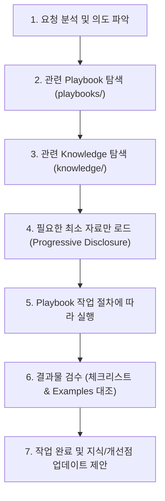
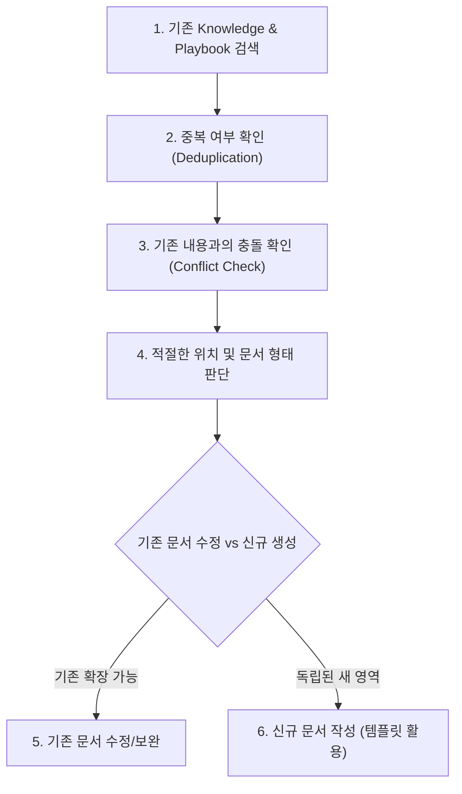

# Knowledge & Playbook Management Skill

본 스킬은 프로젝트 내에 축적된 **Knowledge(무엇을 알고 있는가)**와 **Playbook(어떻게 수행하는가)**을 AI Agent가 효과적으로 탐색, 적용, 확장하기 위한 실행 지침서입니다.

컨텍스트 토큰의 낭비를 방지하기 위해 **모든 상세 지식은 개별 파일로 분리 관리(Progressive Disclosure)**하며, 본 스킬은 Agent의 행동 흐름과 지식 생명주기를 규정합니다.

---

## 1. 시스템 디렉터리 아키텍처

```text
.agents/skills/knowledge-management/
├── SKILL.md                 # 본 파일 (에이전트 실행 및 지식 관리 워크플로우 정의)
├── playbooks/               # 업무 실행 절차서 ("어떻게 일을 수행하는가")
├── knowledge/               # 축적된 지식 베이스 ("무엇을 알고 있는가")
├── examples/                # 실제 실행 결과물 아카이브
│   ├── good/                # 성공 사례, 모범 결과물, 올바른 판단 사례
│   └── bad/                 # 실패 사례, 이슈 발생 사례, 개선 필요 판단
└── templates/               # 표준 문서 작성용 템플릿
```

---

## 2. 작업 수행 표준 워크플로우 (Task Execution Flow)

Agent가 사용자의 작업 요청을 받았을 때 수행해야 하는 표준 7단계 프로세스입니다:



### Step 1: 사용자 요청 분석
- 사용자가 요구하는 작업의 목적, 범위, 산출물 형식을 파악합니다.

### Step 2: 관련 Playbook 탐색
- [playbooks/](file:///C:/Users/zipo1/workspace/budget-book/.agents/skills/knowledge-management/playbooks) 디렉터리에서 해당 작업과 연관된 플레이북이 있는지 파일명과 메타데이터를 검색합니다.
- 플레이북이 존재하는 경우 해당 플레이북을 실행 기준으로 삼습니다.

### Step 3: 관련 Knowledge 탐색
- [knowledge/](file:///C:/Users/zipo1/workspace/budget-book/.agents/skills/knowledge-management/knowledge) 디렉터리에서 해당 작업과 연관된 검증된 사실, 결정 사항, 선행 조사 결과, 주의사항 등을 검색합니다.

### Step 4: 필요한 자료만 선별 로드
- 발견된 문서 전체를 무차별 로드하지 않고, 현재 작업에 직접적으로 필요한 부분만 읽어 컨텍스트 윈도우를 최적화합니다.

### Step 5: Playbook 절차에 따른 작업 수행
- 플레이북에 정의된 Step별 절차, 판단 기준, 금지사항을 철저히 준수하여 작업을 진행합니다.

### Step 6: 결과물 검수
- 플레이북의 **검수 체크리스트**와 [examples/](file:///C:/Users/zipo1/workspace/budget-book/.agents/skills/knowledge-management/examples) 내의 모범 사례(`good/`) 및 실패 사례(`bad/`)를 대조하여 결과물의 품질을 최종 점검합니다.

### Step 7: 새로운 지식 및 개선점 업데이트 제안
- 작업을 수행하면서 새롭게 확인된 사실, 발견된 문제의 해결책, 기존 플레이북의 미비점이 있다면 사용자에게 다음과 같이 보고합니다:
  - "이번 작업을 진행하며 [새로운 지식/개선점]을 발견했습니다. 이를 `knowledge/` 또는 `playbooks/`에 반영할까요?"

---

## 3. 지식 축적 및 개선 워크플로우 (Knowledge Management Flow)

사용자가 다음과 같은 지식 관리 요청을 한 경우 적용하는 6단계 절차입니다:
- *"이걸 Knowledge로 저장해."*
- *"이 경험을 Knowledge로 정리해."*
- *"이걸 Playbook으로 만들어."*
- *"이 실패 사례를 저장해."*
- *"기존 Playbook을 개선해."*
- *"이 내용을 기존 Knowledge와 합쳐."*



### 1단계: 기존 문서 검색
- 추가하려는 지식/절차와 유사한 주제가 이미 존재하는지 `grep_search` 또는 `find_by_name`을 통해 검색합니다.

### 2단계: 중복 확인 (Deduplication)
- 이미 기록된 동일한 내용이 있는지 검토합니다. 동일한 내용을 다른 파일에 복제 생성하지 않습니다 (단일 진실 공급원 유지).

### 3단계: 충돌 확인 (Conflict Check)
- 새 지식이 기존 지식이나 플레이북의 내용과 모순되거나 충돌하는지 검증합니다.
- 만약 충돌이 있다면, 임의로 기존 내용을 지우거나 덮어쓰지 않고 변경 사유를 명시하고 사용자에게 알립니다.

### 4단계: 적절한 위치 및 분류 판단
- 절차성 업무 가이드: `playbooks/`
- 배경 지식/사실/결정 사항: `knowledge/`
- 구체적 산출물 및 판단 사례: `examples/good/` 또는 `examples/bad/`

### 5단계: 기존 문서 수정
- 기존 문서에 내용을 추가하거나 최신화하는 것으로 충분하다면 기존 문서를 업데이트합니다.

### 6단계: 신규 문서 생성
- 완전히 새로운 독립 영역인 경우에만 [templates/](file:///C:/Users/zipo1/workspace/budget-book/.agents/skills/knowledge-management/templates)의 표준 서식을 활용하여 신규 문서를 생성합니다.

---

## 4. 지식 5대 분류 체계

지식을 기록할 때는 반드시 아래 5가지 유형을 명시적으로 구분하여 작성합니다. AI는 추측이나 가정을 사실로 둔갑시켜서는 안 됩니다.

| 유형 | 영문명 | 정의 및 기준 | 예시 |
| :--- | :--- | :--- | :--- |
| **사실** | **Fact** | 객관적으로 검증된 데이터, 공식 기술 사양, 입증된 수치 | "Next.js 15에서는 Turbopack이 기본 지원된다." |
| **관찰** | **Observation** | 실제 실행 중 측정되거나 확인된 현상, 사용자 행동 | "빌드 시 메모리 점유율이 2GB까지 상승함." |
| **가설** | **Hypothesis** | 아직 완전히 검증되지 않은 논리적 추론이나 예상 | "캐싱 계층을 도입하면 응답 시간이 50% 단축될 것이다." |
| **결정** | **Decision** | 특정 시점에 확정된 아키텍처/비즈니스 의사결정과 사유 | "상태 관리는 복잡도 최소화를 위해 Zustand로 통일한다." |
| **교훈** | **Lesson** | 성공/실패 경험 및 회고를 통해 얻은 통찰 | "초기 스키마 설계 시 유연성보다 명시적 제약을 두는 편이 마이그레이션 비용을 낮춘다." |

---

## 5. 지식 발전 순환 루프 (Virtuous Learning Cycle)

본 시스템의 궁극적인 목적은 프로젝트가 진행될수록 AI Agent의 업무 정확도와 자율성이 점진적으로 고도화되는 것입니다:

```text
    경험 (Experience)
          ↓
    Knowledge (지식 축적)
          ↓
    Playbook (절차 고도화)
          ↓
    AI Agent 실행 (Task Execution)
          ↓
    결과 (Output & Deliverables)
          ↓
    회고 (Retrospective & Feedback)
          ↓
    Knowledge 개선 / Playbook 개선
          ↓
      다음 실행 (Next Execution)
```

---

## 6. 컨텍스트 최적화 지침 (Progressive Disclosure)

1. **인덱스 활용**: `playbooks/README.md` 및 `knowledge/README.md`의 목록을 먼저 훑고, 필요한 파일만 엽니다.
2. **선택적 로드**: 전체 지식 저장소를 한 번에 컨텍스트로 불러오지 마십시오.
3. **요약 유지**: `SKILL.md`에는 메타 규칙과 워크플로우만 유지하며 개별 도메인의 비즈니스 로직을 직접 포함하지 않습니다.
